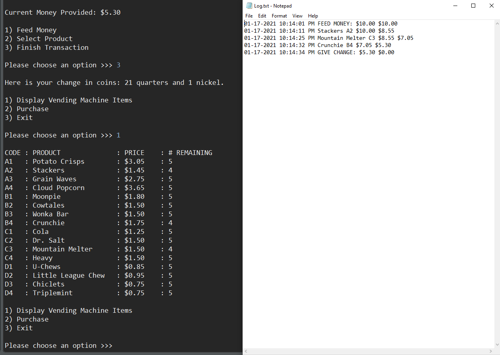

# Vending Machine

## Introduction
A vending machine application developed in Java while utilizing pair programming. It implements loops, arrays, lists, inheritance, JUnit testing, as well as reading in and writing out to a file.
## Visuals
